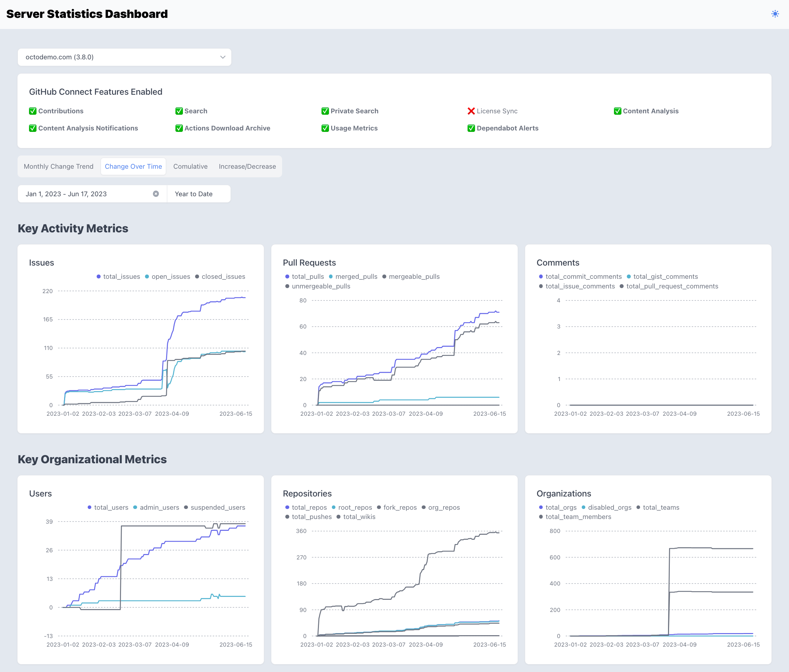

# Server Statistics Dashboard for GitHub Enterprise Server

The GitHub Enterprise Server Dashboard is a sample implementation of a dashboard for GitHub Enterprise Server. It provides server statistics and collects aggregate usage data from your GitHub Enterprise Server instance, allowing you to better anticipate the needs of your organization, understand how your team works, and demonstrate the value you get from GitHub Enterprise Server.

[Watch the YouTube video :video_camera:](https://youtu.be/watch?feature=player_embedded&v=iH-u35a733E)

## Features

- Collect and display server statistics for GitHub Enterprise Server
- Aggregate usage data for repositories, issues, pull requests, and more
- Gain insights into your enterprise server's usage and user dynamics
- Show the information of GitHub Enterprise Server

## Installation

To install and run the GitHub Enterprise Server Dashboard, follow these steps:

1. Fork the repository
2. Set GitHub Personal Access Token in the GitHub Action's secret
3. Set the Enterprise Name in the GitHub Action's secret
4. Then, GitHub Actions run the workflow and dashboard is deployed to the GitHub Pages
5. Access the dashboard page in GitHub Pages

## Build

To build the GitHub Enterprise Server Dashboard, follow these steps:

## Contributing

We welcome contributions to the GitHub Enterprise Server Dashboard project. To contribute, please follow these steps:

1. Fork the repository
2. Create a new branch: `git checkout -b feature/new-feature`
3. Make your changes and commit them: `git commit -m 'Add new feature'`
4. Push to the branch: `git push origin feature/new-feature`
5. Create a new pull request

## License

This project is licensed under the [MIT License](LICENSE).

## Acknowledgements

We would like to thank the GitHub community for their support and contributions to this project.
